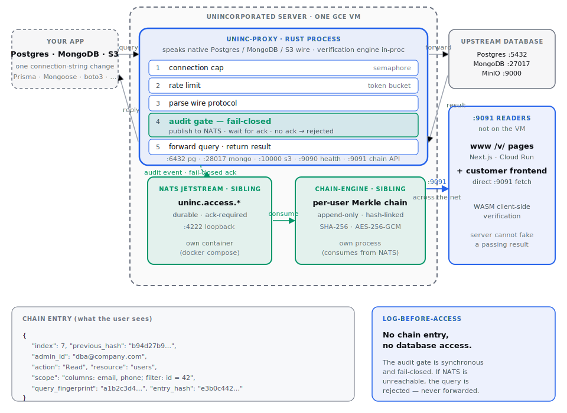

# The Unincorporated Server

A wire-protocol proxy in front of Postgres, MongoDB, and S3 that writes every query to a per-user hash chain. The end user verifies their own chain in the browser — verification runs on the user's device, not the operator's. Any modification to a previously-served chain is detectable via the `prev_hash` linkage specified in [Data Access Transparency v1](protocol/draft-wang-data-access-transparency-00.md) §4.5 and §5.2.

> ⚠️ **Status: experimental / pre-1.0.**
>
> - The public surface (wire protocols, chain format, config shape) may change without notice.
> - Test coverage is sparse. `cargo test` runs but does not cover the full audit-gate + chain + cross-replica paths end to end. Don't put this in front of production data without your own review.
> - Contributions welcome — especially tests, deploy recipes (`deploy/aws/`, `deploy/bare-metal/`), and protocol review. See [CONTRIBUTING.md](CONTRIBUTING.md).

**AGPLv3.**

---

## Quickstart

```bash
git clone https://github.com/uninc-app/server.git
cd server
cp .env.example .env   # fill in passwords + JWT_SECRET + CHAIN_SERVER_SALT
docker compose -f docker/docker-compose.yml up -d
```

The stack comes up with Postgres, MongoDB, and MinIO behind the proxy. Hit `psql -h localhost -p 6432 -U admin -d mydb` (default password `change-me`, see [docker/config/postgres/init.sql](docker/config/postgres/init.sql)), run any query, then `curl http://localhost:9091/api/v1/chain/deployment/summary`. Full walkthrough: [QUICKSTART.md](QUICKSTART.md).

---

## Features

- Postgres, MongoDB, and S3 (MinIO-compatible) wire-protocol proxy
- Fail-closed synchronous audit gate — NATS JetStream `ack-before-forward`
- Per-user hash chains implementing [Data Access Transparency v1](protocol/draft-wang-data-access-transparency-00.md) — binary envelope (§4.1), JCS-canonicalized JSON payloads (§4.9), `SHA-256(serialize(entry))` hash (§5.1)
- Deployment-wide admin chain carrying `DeploymentEvent` payloads (§4.11)
- Chain API on `:9091` — JWT HS256, paginated entries, user-initiated erasure (spec §7.3)
- Rust→WASM client-side verifier in [`crates/chain-verifier-wasm/`](crates/chain-verifier-wasm/) implementing spec §5.2
- Cross-replica state fingerprinting — Postgres SHA-256 over sorted rows, MongoDB `dbHash`, MinIO sorted `(key,ETag)` manifest
- Independent Observer process subscribing to native replication streams (Postgres logical replication, MongoDB change streams, MinIO bucket notifications)
- Drand-seeded replica role assignment (gated behind `UNINC_ENABLE_DRAND` in v1)
- Operator CLI (`uninc chain list/verify/export`)
- Protocol spec: [protocol/draft-wang-data-access-transparency-00.md](protocol/draft-wang-data-access-transparency-00.md)

Known gaps: [ARCHITECTURE.md §v1 coverage limits](ARCHITECTURE.md#v1-coverage-limits-across-these-flows).

---

## How it works

<p align="center">
  
</p>

The audit gate is synchronous and fail-closed. The proxy waits for the JetStream ack *before* forwarding the query. If the audit stream is unreachable, the query is rejected — never forwarded. No data access can happen without a chain entry.

## What a chain entry looks like

An admin runs `SELECT email, phone FROM users WHERE id = 42`. The affected user's chain gets an AccessEvent (spec §4.10) framed in the standard envelope (§4.1):

```json
{
  "version": 1,
  "index": 7,
  "timestamp": 1744444800,
  "prev_hash": "b94d27b9...",
  "payload_type": 1,
  "payload": {
    "actor_id": "dba@company.com",
    "actor_type": "admin",
    "actor_label": "Jane (DBA)",
    "protocol": "postgres",
    "action": "read",
    "resource": "users",
    "affected_user_ids": ["b2c3a1f0..."],
    "query_fingerprint": "a1b2c3d4...",
    "query_shape": "SELECT email, phone FROM users WHERE id = $1",
    "scope": { "rows": 1, "bytes": 128 },
    "source_ip": "10.0.0.42",
    "session_id": "11111111-2222-3333-4444-555555555555"
  },
  "entry_hash": "e3b0c442..."
}
```

Raw SQL is never stored — only `query_fingerprint` (SHA-256 of the normalized query) and an optional parameterized `query_shape`. The chain is append-only; each entry's `prev_hash` links to the previous entry's `entry_hash`, so tampering with one breaks every subsequent hash. The browser verifier recomputes each hash locally per spec §5.2.

---

## Deployment shapes

The code doesn't care which shape you run. Three common ones:

1. **Single-host Docker Compose, batteries included** — `docker/docker-compose.yml`. Proxy + chain-engine + NATS + upstream Postgres/MongoDB/MinIO, all on one host. This is the quickstart path.
2. **Docker Compose, bring your own DB** — `docker/docker-compose.self-hosted.yml`. Proxy + chain-engine + NATS + pgbouncer. Points at upstream DBs you already run elsewhere. Runtime config lives in [uninc.yml](uninc.yml.example) — mount it into the proxy service (see [docker/README.md](docker/README.md#how-uninc-yml-fits-in)).
3. **Multi-VM with replica verification** — proxy VM + N replica VMs (3/5/7) + independent Observer VM. Cross-replica state fingerprinting and Observer-vs-proxy chain divergence detection run on a nightly schedule. See [ARCHITECTURE.md §Verification taxonomy](ARCHITECTURE.md#verification-taxonomy--what-verify-means-in-which-context) and [deploy/gcp/](deploy/gcp/) for the Terraform recipe.

A managed deployment of shape #3 is available at [unincorporated.app](https://unincorporated.app) if you don't want to run it yourself.

---

## The Observer

The proxy is the sole writer of the proxy's chains. A compromised proxy can write the same forged history to every storage replica, so multi-copy storage alone does not defeat writer compromise. The Observer is an independent process on a separate VM that subscribes to each primitive's native replication stream — Postgres logical replication, MongoDB change streams, MinIO bucket notifications — and writes its own chain from those events. Verification compares the two chains per protocol spec §5.5. Any divergence emits a `verification_failure` `DeploymentEvent` on the deployment chain and fires the failure-handler chain. See [docs/replica-verification.md](docs/replica-verification.md).

---

## Positioning

Most database audit tooling (pgaudit, Retraced, CloudTrail, the DAM category) is admin-configurable and bypassable by the admin being watched — the audit log sits inside the operator's trust boundary. The protocol defined at [protocol/draft-wang-data-access-transparency-00.md](protocol/draft-wang-data-access-transparency-00.md) moves the verification boundary to the data subject's device: the operator can still read and write the log, but cannot rewrite it without the change being detectable by any user who holds a previously-issued head hash.

The closest prior art is Google Access Transparency — proprietary, GCP-only, operator-to-operator visibility. `server/` publishes the same category of control as an open-source protocol visible to the data subject.

---

## Tech stack

| Component | Implementation |
|---|---|
| Proxy | Rust (tokio, hyper, hand-rolled Postgres/MongoDB wire parsers) |
| Chain engine | Rust (SHA-256, AES-256-GCM, append-only I/O) |
| Observer | Rust (`tokio-postgres` logical replication, MongoDB `watch()`, NATS bucket notifications) |
| Chain API | Axum on `:9091`, built into `uninc-proxy` |
| Browser verifier | Rust → WebAssembly — same hash code as the server |
| Queue | NATS JetStream |
| IaC | Terraform (GCP shipping; AWS and bare-metal are placeholders) |

Full dependency rationale: [TECHSTACK.md](TECHSTACK.md).

## Crate map

| Crate | Binary | Purpose |
|---|---|---|
| `crates/uninc-common/` | — | Shared types, config, NATS client, crypto |
| `crates/proxy/` | `uninc-proxy` | Wire-protocol proxy, guard pipeline, audit gate, `:9091` chain API |
| `crates/chain-store/` | — | Binary envelope + JCS payload canonicalization, `SHA-256(serialize(entry))` hash, on-disk chain format, tombstone writes |
| `crates/chain-engine/` | `chain-engine` | NATS consumer, per-user + deployment chain writer |
| `crates/chain-verifier-wasm/` | — | Rust → WebAssembly browser verifier |
| `crates/verification/` | — | Replica role assignment, cross-replica state comparison, failure handler |
| `crates/observer/` | `observer` | Independent WAL/oplog/bucket-notify subscriber |
| `crates/cli/` | `uninc` | Operator CLI for chain inspection, verification, export |

---

## Protocol spec

[`protocol/draft-wang-data-access-transparency-00.md`](protocol/draft-wang-data-access-transparency-00.md) is a specification, not just a description of what this codebase happens to do. A compliant third-party verifier in any language produces bit-identical hash outputs. If our implementation disagrees with a compliant verifier, the spec is the arbiter.

---

## Documentation

| Doc | What it covers |
|---|---|
| [QUICKSTART.md](QUICKSTART.md) | 5-minute Docker Compose walkthrough |
| [ARCHITECTURE.md](ARCHITECTURE.md) | Runtime data paths, trust boundaries, deployment shapes, verification taxonomy |
| [DEVELOPMENT.md](DEVELOPMENT.md) | Build, test, and run from source |
| [TECHSTACK.md](TECHSTACK.md) | Every dependency, what we hand-roll |
| [CONTRIBUTING.md](CONTRIBUTING.md) | How to send a change |
| [deploy/](deploy/) | Cloud deploy recipes (GCP shipping, AWS + bare-metal placeholders) |
| [docker/README.md](docker/README.md) | Which compose file is for what; where `uninc.yml` mounts |
| [docs/](docs/) | Deep-dive specs: proxy wire protocols, Merkle chains, cross-replica verification, identity separation, chain API, transparency-view UI contract |

---

## License

**AGPLv3.** Modifications to a running transparency service MUST be published; a service that silently modifies the code end users verify against defeats the protocol's guarantees. Companies embedding `server/` in proprietary products can purchase a commercial license.

---

## Data retention and erasure

The Unincorporated Server follows the GDPR-aware retention model of [protocol spec §8](protocol/draft-wang-data-access-transparency-00.md):

- **Per-user chains** (one per data subject) carry row-level AccessEvent entries (spec §4.10) under HMAC-salted directory names (`HMAC-SHA-256(CHAIN_SERVER_SALT, user_id)`, spec §3.2). They are deletable in response to an Article 17 erasure request via `DELETE /api/v1/chain/u/{user_id}` (spec §7.3) — the authenticated data subject issues the request against their own `user_id`, and the proxy removes the directory from disk.
- **The deployment chain** (one per deployment) carries table-level DeploymentEvent entries (spec §4.11) — no row-level scope, no `affected_user_ids`. It is immutable because it contains no personal data.
- **Erasure emits a tombstone** `DeploymentEvent` with `category = "user_erasure_requested"` so the fact that an erasure happened is itself auditable, even though the erased content is gone. The proxy commits the tombstone to the deployment chain BEFORE deleting the per-user chain from disk — tombstone-first ordering guarantees that if anything gets deleted, the audit trail of the request exists. The proxy-to-chain-engine handoff runs over a core-NATS request/reply on `uninc.control.erasure` (see [crates/chain-engine/src/erasure_handler.rs](crates/chain-engine/src/erasure_handler.rs)); the HTTP reply carries the real `(tombstone_entry_id, tombstone_deployment_chain_index)` so clients can re-fetch and verify the tombstone client-side.
- **Retention sweeps** (planned for v1.x) batch-delete per-user chain entries older than `retention_days` and emit a `retention_sweep` DeploymentEvent per batch.

The deployment chain (no personal data) retains indefinitely. Per-user chains retain only for the lifetime of the subject's relationship with the deployment.
