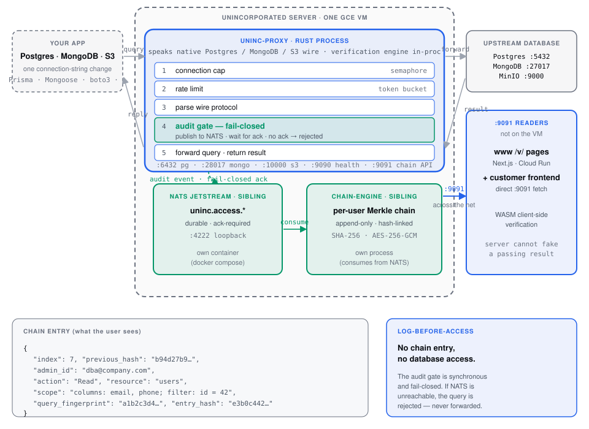

# Data Access Transparency — reference server

This repository is the reference implementation of [**Data Access Transparency v1**](protocol/draft-wang-data-access-transparency-00.md), an open protocol for tamper-evident logs of database access that the affected end user can verify on their own device.

Most database audit tooling — pgaudit, Retraced, CloudTrail, the DAM category — is admin-configurable and bypassable by the admin being watched. The log lives inside the operator's trust boundary, so "we have audit logs" is a promise the operator makes about themselves. Data Access Transparency moves the verification boundary to the data subject: the operator can still read and write the log, but cannot rewrite previously-served history without the change being detectable by any user holding an earlier head hash.

The closest prior art is Google's Access Transparency — proprietary, GCP-only, operator-to-operator visibility. This repo publishes the same category of control as an open protocol, with verification that runs in the end user's browser.

```
            app
             │
             ▼
   ┌─────────────────────┐    audit ack (fail-closed)    ┌──────────────┐
   │  transparency proxy │◀──────────────────────────────│ chain engine │
   │  (Postgres / Mongo  │                               │ (per-user +  │
   │   / S3 wire parser) │──── forward query ──▶  DB     │  deployment  │
   └─────────────────────┘                               │   chains)    │
             │                                           └──────┬───────┘
             │  :9091 chain API (JWT)                           │
             ▼                                                  ▼
   end user's browser  ◀──  WASM verifier recomputes hashes  ── on-disk
```

**AGPLv3. Pre-1.0.** The protocol draft is stable enough to implement against; this implementation is still moving. See [Status](#status) before deploying in front of production data.

> **Don't want to operate the server yourself?** A managed [Customer-verifiable Data Access Transparency](https://unincorporated.app) deployment is available at [unincorporated.app](https://unincorporated.app) — same protocol, same browser-side WASM verifier, same chain format; the operator runs the proxy, replicas, and Observer VM for you on GCP. Self-hosting and the managed tier are interoperable: a chain produced by either is verifiable by the other.

---

## Table of contents

- [Data Access Transparency — reference server](#data-access-transparency--reference-server)
  - [Table of contents](#table-of-contents)
  - [What's in this repo](#whats-in-this-repo)
  - [Status](#status)
  - [Quickstart](#quickstart)
  - [How it works](#how-it-works)
  - [What a chain entry looks like](#what-a-chain-entry-looks-like)
  - [The Observer](#the-observer)
  - [Deployment shapes](#deployment-shapes)
  - [What a release contains](#what-a-release-contains)
  - [Tech stack](#tech-stack)
  - [Crate map](#crate-map)
  - [Data retention and erasure](#data-retention-and-erasure)
  - [Documentation](#documentation)
  - [License](#license)

---

## What's in this repo

A Rust workspace that implements the full server side of the protocol:

- **Wire-protocol proxy** for Postgres, MongoDB, and S3 (MinIO-compatible)
- **Fail-closed synchronous audit gate** — every query waits for a NATS JetStream `ack-before-forward`; if audit is unreachable, the query is rejected, never forwarded
- **Per-user hash chains** implementing spec §4 (binary envelope, JCS-canonicalized JSON payloads, `SHA-256(serialize(entry))` linkage)
- **Deployment-wide admin chain** carrying `DeploymentEvent` payloads (spec §4.11)
- **Chain HTTP API** on `:9091` — JWT HS256, paginated entries, user-initiated erasure (spec §7)
- **Browser verifier** compiled from Rust to WebAssembly — the same hash code runs on the server and in the end user's browser, per spec §5.2
- **Independent Observer** process that subscribes to each primitive's native replication stream (Postgres logical replication, MongoDB change streams, S3 bucket notifications) and writes its own chain for cross-check per spec §5.5
- **Cross-replica state fingerprinting** — Postgres SHA-256 over sorted rows, MongoDB `dbHash`, S3 sorted `(key,ETag)` manifest
- **Operator CLI** (`chain list / verify / export`)

The protocol draft is the arbiter: [protocol/draft-wang-data-access-transparency-00.md](protocol/draft-wang-data-access-transparency-00.md). A compliant third-party verifier in any language must produce bit-identical hash outputs. If this implementation disagrees with a compliant verifier, the spec wins.

---

## Status

> ⚠️ **Experimental / pre-1.0.**
>
> - The public surface (wire protocols, chain format, config shape) may change without notice while the spec is still `-00`.
> - Test coverage is sparse. `cargo test` runs but does not exercise the full audit-gate + chain + cross-replica paths end to end.
> - Don't put this in front of production data without your own review.
> - Contributions welcome — especially tests, deploy recipes (`deploy/aws/`, `deploy/bare-metal/`), and protocol review. See [CONTRIBUTING.md](CONTRIBUTING.md).

Known gaps: [ARCHITECTURE.md §v1 coverage limits](ARCHITECTURE.md#v1-coverage-limits-across-these-flows).

---

## Quickstart

```bash
git clone https://github.com/un-incorporated/server.git
cd server
cp .env.example .env   # fill in passwords + JWT_SECRET + CHAIN_SERVER_SALT
docker compose -f docker/docker-compose.yml up -d
```

The stack comes up with Postgres, MongoDB, and MinIO behind the proxy. Hit `psql -h localhost -p 6432 -U admin -d mydb` (default password `change-me`, see [docker/config/postgres/init.sql](docker/config/postgres/init.sql)), run any query, then `curl http://localhost:9091/api/v1/chain/deployment/summary`. Full walkthrough: [QUICKSTART.md](QUICKSTART.md).

---

## How it works

<p align="center">
  
</p>

The audit gate is synchronous and fail-closed. The proxy waits for the JetStream ack *before* forwarding the query. If the audit stream is unreachable, the query is rejected. No data access can happen without a chain entry.

## What a chain entry looks like

An admin runs `SELECT email, phone FROM users WHERE id = 42`. The affected user's chain gets an AccessEvent (spec §4.10) framed in the standard envelope (§4.1):

```json
{
  "version": 1,
  "index": 7,
  "timestamp": 1744444800,
  "prev_hash": "b94d27b9...",
  "payload_type": 1,
  "payload": {
    "actor_id": "dba@company.com",
    "actor_type": "admin",
    "actor_label": "Jane (DBA)",
    "protocol": "postgres",
    "action": "read",
    "resource": "users",
    "affected_user_ids": ["b2c3a1f0..."],
    "query_fingerprint": "a1b2c3d4...",
    "query_shape": "SELECT email, phone FROM users WHERE id = $1",
    "scope": { "rows": 1, "bytes": 128 },
    "source_ip": "10.0.0.42",
    "session_id": "11111111-2222-3333-4444-555555555555"
  },
  "entry_hash": "e3b0c442..."
}
```

Raw SQL is never stored — only `query_fingerprint` (SHA-256 of the normalized query) and an optional parameterized `query_shape`. The chain is append-only; each entry's `prev_hash` links to the previous entry's `entry_hash`, so tampering with one breaks every subsequent hash. The browser verifier recomputes each hash locally per spec §5.2.

---

## The Observer

The proxy is the sole writer of the proxy's chains. A compromised proxy can write the same forged history to every storage replica, so multi-copy storage alone does not defeat writer compromise.

The Observer is an independent process on a separate VM that subscribes to each primitive's native replication stream — Postgres logical replication, MongoDB change streams, S3 bucket notifications — and writes its own chain from those events. Verification compares the two chains per spec §5.5. Any divergence emits a `verification_failure` `DeploymentEvent` on the deployment chain and fires the failure-handler chain. See [docs/replica-verification.md](docs/replica-verification.md).

---

## Deployment shapes

The code doesn't care which shape you run. Three common ones:

1. **Single-host Docker Compose, batteries included** — `docker/docker-compose.yml`. Proxy + chain engine + NATS + upstream Postgres/MongoDB/MinIO, all on one host. This is the quickstart path.
2. **Docker Compose, bring your own DB** — `docker/docker-compose.self-hosted.yml`. Proxy + chain engine + NATS + pgbouncer. Points at upstream DBs you already run elsewhere. Runtime config lives in [uninc.yml](uninc.yml.example) — mount it into the proxy service (see [docker/README.md](docker/README.md#how-uninc-yml-fits-in)).
3. **Multi-VM with replica verification** — proxy VM + N replica VMs (3/5/7) + independent Observer VM. Cross-replica state fingerprinting and Observer-vs-proxy chain divergence detection run on a nightly schedule. See [ARCHITECTURE.md §Verification taxonomy](ARCHITECTURE.md#verification-taxonomy--what-verify-means-in-which-context) for the runtime picture and [deploy/gcp/](deploy/gcp/) for the Terraform module. In-repo example consumers live under [deploy/gcp/examples/](deploy/gcp/examples/); point your own Terraform at `git::https://github.com/un-incorporated/server.git//deploy/gcp/modules/uninc-server?ref=<tag>` (never `ref=main`) and pass in the variables documented in [deploy/gcp/modules/uninc-server/main.tf](deploy/gcp/modules/uninc-server/main.tf).

Walkthroughs:

- [docs/self-hosting.md](docs/self-hosting.md) — all three Compose shapes step-by-step, with `uninc.yml` requirements, the `+1000` port shift, and an authoritative port map. Also rendered at [unincorporated.app/docs/self-host](https://unincorporated.app/docs/self-host) (synced hourly from this file).
- [deploy/gcp/images/README.md](deploy/gcp/images/README.md) — per-role baked disk images (`uninc-proxy`, `uninc-db`, `uninc-observer`) for production deploys. Single attestable artifact per release, no first-boot egress, byte-identical between self-hosters and the managed tier. Rendered at [unincorporated.app/#self-host-guide](https://unincorporated.app/#self-host-guide).

A managed [Data Access Transparency deployment](https://unincorporated.app) of shape 3 (multi-VM with Observer) is available at [unincorporated.app](https://unincorporated.app) if you don't want to run it yourself.

## What a release contains

One git tag ships four artifacts: the browser WASM verifier, the
Terraform module, the Docker images (proxy / observer), and the
per-role bootable disk images (`uninc-proxy`, `uninc-db`,
`uninc-observer`). Consumers pin each independently — the WASM via
`www/wasm-version.txt`, the Terraform via `?ref=vX.Y.Z`, the Docker
images via their `:tag`, the disk images via the
`UNINC_GCE_IMAGE_VERSION` pin in `www/`. Full release model and CI
mechanics in [RELEASES.md](RELEASES.md).

---

### Why per-role baked disk images at all

The DB and observer VMs run on the private subnet with no public IP and
(intentionally) no Cloud NAT. Without internet egress, they cannot
`apt-get install postgres` or `docker pull` the observer container at
first boot. The proxy VM has a public IP and *could* install on the fly,
but two customer VMs created a week apart would silently get different
glibc patch levels and different pgbouncer micro-versions — drift the
rest of the stack (chain, observer, transparency proofs) is trying to
eliminate.

Baking the runtime into a per-role image gives the protocol a single
attestable runtime artifact per release: same trust shape as the
container images, applied to the entire VM. Boot is config-only — read
GCE metadata, render `proxy.yml`/`observer.yml`, `docker compose up -d`
against locally-cached images. Deterministic, fast, no egress required.

Distribution: the workflow uploads each role's bootable
`disk.raw` (compressed in a tar.gz) directly to the GitHub Release for
the tag. No cloud-vendor registry, no GCP secrets in CI, anyone can
download and verify the artifact. The mothership lazy-imports each
tar.gz into its own GCP project on first deploy of every release tag.

Build mechanics in [`deploy/gcp/images/`](deploy/gcp/images/); release
flow in [RELEASES.md](RELEASES.md).

## Tech stack

| Component | Implementation |
|---|---|
| Proxy | Rust (tokio, hyper, hand-rolled Postgres/MongoDB wire parsers) |
| Chain engine | Rust (SHA-256, AES-256-GCM, append-only I/O) |
| Observer | Rust (`tokio-postgres` logical replication, MongoDB `watch()`, NATS bucket notifications) |
| Chain API | Axum on `:9091`, built into the proxy binary |
| Browser verifier | Rust → WebAssembly — same hash code as the server |
| Queue | NATS JetStream |
| VM images | Packer-baked disk images per role (`uninc-proxy`, `uninc-db`, `uninc-observer`) — Docker, every container image, and the static compose YAML pre-installed so customer VMs need zero internet egress at first boot. Distributed via GitHub Releases as `uninc-{role}-vX-Y-Z.tar.gz` (each containing a bootable `disk.raw`); no cloud-vendor registry. See [`deploy/gcp/images/README.md`](deploy/gcp/images/README.md). |
| VM boot | `uninc-boot.service` — a small open-source systemd unit that replaces `google-startup-scripts.service` so we can stay off Google's closed-source guest-agent package. Tees boot output to syslog, serial console, and `/var/log/uninc-boot.log` for debug. See [ARCHITECTURE.md §VM boot orchestration](ARCHITECTURE.md#vm-boot-orchestration). |
| Sealed VMs | Customer VMs ship without functional sshd — host keys deleted, `sshd_config` stubbed, the systemd unit masked, and the build-time `packer` + default `debian` users removed. Permanent, not a v0.1 simplification: the protocol's tamper-evidence claim depends on the operator being unable to mutate the chain or the proxy via shell. Debug is via GCE serial console, Cloud Logging, and (last resort) read-only disk-detach inspection — see [docs/ops-debugging.md](docs/ops-debugging.md) and [ARCHITECTURE.md §Sealed-VM trust model](ARCHITECTURE.md#sealed-vm-trust-model). |
| IaC | Terraform (GCP shipping; AWS and bare-metal are placeholders) |

Full dependency rationale: [TECHSTACK.md](TECHSTACK.md).

## Crate map

| Crate | Binary | Purpose |
|---|---|---|
| `crates/uninc-common/` | — | Shared types, config, NATS client, crypto |
| `crates/proxy/` | `uninc-proxy` | Wire-protocol proxy, guard pipeline, audit gate, `:9091` chain API |
| `crates/chain-store/` | — | Binary envelope + JCS payload canonicalization, `SHA-256(serialize(entry))` hash, on-disk chain format, tombstone writes |
| `crates/chain-engine/` | `chain-engine` | NATS consumer, per-user + deployment chain writer |
| `crates/chain-verifier-wasm/` | — | Rust → WebAssembly browser verifier |
| `crates/verification/` | — | Replica role assignment, cross-replica state comparison, failure handler |
| `crates/observer/` | `observer` | Independent WAL/oplog/bucket-notify subscriber |
| `crates/cli/` | `uninc` | Operator CLI for chain inspection, verification, export |

---

## Data retention and erasure

This implementation follows the GDPR-aware retention model of [spec §8](protocol/draft-wang-data-access-transparency-00.md):

- **Per-user chains** (one per data subject) carry row-level AccessEvent entries (spec §4.10) under HMAC-salted directory names (`HMAC-SHA-256(CHAIN_SERVER_SALT, user_id)`, spec §3.2). They are deletable in response to an Article 17 erasure request via `DELETE /api/v1/chain/u/{user_id}` (spec §7.3) — the authenticated data subject issues the request against their own `user_id`, and the proxy removes the directory from disk.
- **The deployment chain** (one per deployment) carries table-level DeploymentEvent entries (spec §4.11) — no row-level scope, no `affected_user_ids`. It is immutable because it contains no personal data.
- **Erasure emits a tombstone** `DeploymentEvent` with `category = "user_erasure_requested"` so the fact that an erasure happened is itself auditable, even though the erased content is gone. The proxy commits the tombstone to the deployment chain BEFORE deleting the per-user chain from disk — tombstone-first ordering guarantees that if anything gets deleted, the audit trail of the request exists. The proxy-to-chain-engine handoff runs over a core-NATS request/reply on `uninc.control.erasure` (see [crates/chain-engine/src/erasure_handler.rs](crates/chain-engine/src/erasure_handler.rs)); the HTTP reply carries the real `(tombstone_entry_id, tombstone_deployment_chain_index)` so clients can re-fetch and verify the tombstone client-side.
- **Retention sweeps** (planned for v1.x) batch-delete per-user chain entries older than `retention_days` and emit a `retention_sweep` DeploymentEvent per batch.

The deployment chain (no personal data) retains indefinitely. Per-user chains retain only for the lifetime of the subject's relationship with the deployment.

---

## Documentation

| Doc | What it covers |
|---|---|
| [protocol/draft-wang-data-access-transparency-00.md](protocol/draft-wang-data-access-transparency-00.md) | The protocol spec this repo implements |
| [../IMPLEMENTATIONS.md](../IMPLEMENTATIONS.md) | Why `www/` is a second reference implementation of this repo's YAML configuration schema, where the two meet (config, Docker ABI, HTTP responses, chain wire format), and how drift is detected. Read this if you're changing any `UnincConfig` struct, env-var contract, or HTTP response shape. |
| [../CONCEPTS.md](../CONCEPTS.md) | Plain-language definitions of VM / container / image / shape / colocate, with diagrams of every topology this project uses. Read first if the words in ARCHITECTURE.md don't have crisp meaning yet. |
| [QUICKSTART.md](QUICKSTART.md) | 5-minute Docker Compose walkthrough |
| [ARCHITECTURE.md](ARCHITECTURE.md) | Runtime data paths, trust boundaries, deployment shapes, verification taxonomy |
| [DEVELOPMENT.md](DEVELOPMENT.md) | Build, test, and run from source |
| [docs/ops-debugging.md](docs/ops-debugging.md) | Operator runbook for debugging a broken deployment — serial console, Cloud Logging, and the `uninc-debug-ssh-keys` SSH escape hatch |
| [RELEASES.md](RELEASES.md) | The three release artifacts (WASM, Terraform module, Docker images), how releases are cut, and how consumers pin versions |
| [TECHSTACK.md](TECHSTACK.md) | Every dependency, what we hand-roll |
| [CONTRIBUTING.md](CONTRIBUTING.md) | How to send a change |
| [deploy/](deploy/) | Cloud deploy recipes (GCP shipping, AWS + bare-metal placeholders) |
| [docker/README.md](docker/README.md) | Which compose file is for what; where `uninc.yml` mounts |
| [docs/](docs/) | Deep-dive specs: proxy wire protocols, Merkle chains, cross-replica verification, identity separation, chain API, transparency-view UI contract |

---

## License

**AGPLv3.** Modifications to a running transparency service MUST be published; a service that silently modifies the code end users verify against defeats the protocol's guarantees. Companies embedding this server in proprietary products can purchase a commercial license.
